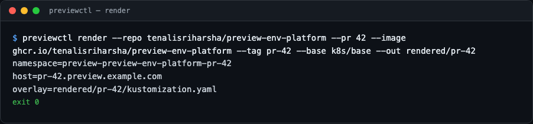
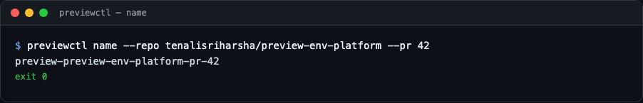
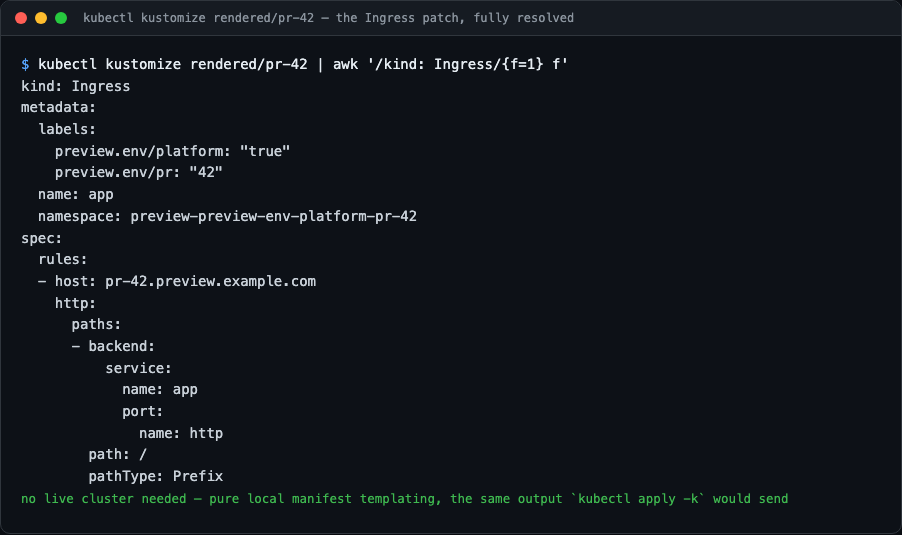
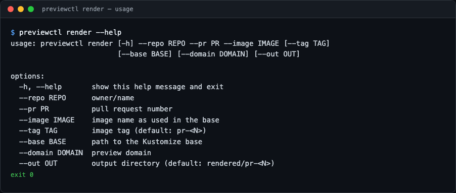

# preview-env-platform

A mini platform-engineering tool: **every pull request gets its own temporary
Kubernetes environment** — a namespace running the PR build of the app, with the
preview URL commented back on the PR. Merged or closed? The environment is torn
down automatically. Forgotten? A cleanup CronJob sweeps it up.

GitHub Actions driven · Kustomize based · stdlib-only Python CLI · fully tested.

## Preview

`previewctl` naming and rendering a real overlay for PR #42, then the fully
resolved manifest `kubectl apply -k` would actually send (no live cluster
needed for any of this — it's pure local templating):



<details>
<summary>More views</summary>







</details>

## How it works

```
PR opened/updated ──► GitHub Actions ──► build image (PR tag)
                                     ──► render Kustomize overlay (previewctl)
                                     ──► kubectl apply → namespace preview-*-pr-N
                                     ──► comment preview URL on the PR

PR closed/merged  ──► GitHub Actions ──► kubectl delete namespace

Hourly (safety)   ──► in-cluster CronJob ──► delete expired preview namespaces
```

## Project Status

**In active development** — built in public, one phase per night. See
[PROGRESS.md](PROGRESS.md) for the full architecture, the phased build plan, and
the current status.

- Phase 1 — core `previewctl` CLI (naming, overlay rendering, PR comments, TTL cleanup) ✅
- Phase 2 — sample app, Kustomize base, RBAC, deploy/teardown GitHub Actions workflows ✅
- Phase 3 — cleanup CronJob, docs, demo, `v0.1.0`

## Layout

```
app/              tiny stdlib HTTP server + Dockerfile — the preview workload
src/previewctl/   stdlib-only CLI: naming, render, comment, cleanup, kubectl/GitHub I/O
tests/            pytest suite for the CLI and the manifests
k8s/base/         Kustomize base (Deployment, Service, Ingress) for the sample app
k8s/rbac.yaml     least-privilege deployer ServiceAccount/ClusterRole
.github/          CI, plus preview/teardown workflows driven by previewctl
docs/             local end-to-end dry-run guide (kind)
```

## The workflows

- **`.github/workflows/preview.yaml`** (PR opened/updated): builds and pushes
  the app image tagged `pr-<N>`, renders the per-PR overlay with
  `previewctl render`, applies it with `kubectl apply -k`, waits for the
  rollout, then upserts the preview-URL comment with `previewctl comment`.
- **`.github/workflows/teardown.yaml`** (PR closed): `previewctl teardown`
  deletes the namespace — it refuses anything without the `preview-` prefix.

Both expect a `KUBECONFIG` secret for cluster access; the preview domain is
configurable via the `PREVIEW_DOMAIN` repository variable.

## Try it locally

See [docs/local-e2e.md](docs/local-e2e.md) for a full dry run against a local
`kind` cluster: render an overlay, `kubectl apply -k` it, curl the app, tear
the namespace down.

## Development

```bash
python3 -m venv .venv && source .venv/bin/activate
pip install -e .[dev]
pytest
```

## License

MIT
